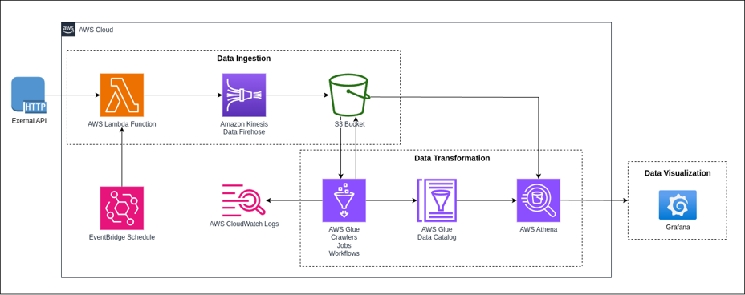

# S&P 500, NASDAQ, and The Magnificent 7: Live Stock & ETF Data Engineering Project – Serverless on AWS 🚀🚀🚀

## Project Overview

This project centers on advanced data engineering techniques applied to the S&P 500 index, NASDAQ index, and data from seven major US tech giants. Leveraging AWS serverless technology, we've implemented a sophisticated ETL pipeline orchestration to seamlessly ingest, transform, and analyze daily stock and ETF data sourced via the Alpha Vantage API. Our primary objective is to provide detailed daily stock updates, summaries of stock information over a period of time, and perform rigorous analysis, with a specific emphasis on technology stocks and trends in the US stock market, particularly focusing on large-cap technology stocks and market trends.

Stocks & ETFs Featured in the Project:
- ETF: VOO (Represent S&P 500); QQQ (Represent NASDAQ)
- Stock (Magnificent 7): AAPL (Apple Inc.); AMZN (Amazon.com Inc.); META (Meta Platforms, Inc.); GOOGL (Alphabet Inc.); MSFT (Microsoft Corporation); NVDA (Nvidia Corporation); TSLA (Tesla, Inc.)

## Key Features

The key features of the entire project center around two main components: a Serverless Automated Data Pipeline and a Daily Updated Stock Dashboard. The former focuses on building the core data transmission process on AWS, encompassing the fully automated ETL pipeline from data retrieval via the Alpha Vantage API to the final Grafana Dashboard. The latter highlights the project's outcomes, providing daily updates on major US tech companies and stock market indices, along with in-depth analytical insights.

- ### Serverless Automated Data Pipeline by AWS
The project primarily utilizes several AWS services to achieve full automation of data transmission, as depicted in the diagram:

 

- ### Daily Updated Stock Dashboard & Analysis

## Want to Answer...

## Data Pipeline with ELT Execution

## Data Visualization Example

## Conclusion
