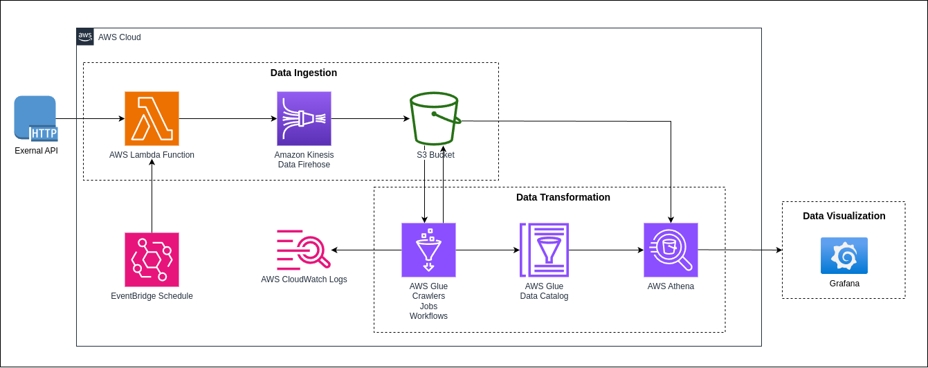

# S&P 500, NASDAQ, Dow Jones and The Magnificent 7: Live Stock & ETF Data Engineering Project – Serverless on AWS 🚀🚀🚀

## Project Overview 🔭🔭 

This project centers on advanced data engineering techniques applied to the S&P 500 index, NASDAQ index, and data from seven major US tech giants. Leveraging AWS serverless technology, we've implemented a sophisticated ETL pipeline orchestration to seamlessly ingest, transform, and analyze daily stock and ETF data sourced via the Alpha Vantage API. Our primary objective is to provide detailed daily stock updates, summaries of stock information over a period of time, and perform rigorous analysis, with a specific emphasis on technology stocks and trends in the US stock market, particularly focusing on large-cap technology stocks and market trends.

Stocks & ETFs Featured in the Project:
- ETF:
      **VOO** (Vanguard S&P 500 ETF, Track S&P 500);
      **QQQ** (Invesco QQQ Trust Series 1, Track NASDAQ);
      **SCHG** (Schwab US Large-Cap Growth ETF, Track Dow Jones U.S. Large-Cap Growth)
- Stock (Magnificent 7):
      **AAPL** (Apple Inc.);
      **AMZN** (Amazon.com Inc.);
      **META** (Meta Platforms, Inc.);
      **GOOGL** (Alphabet Inc.);
      **MSFT** (Microsoft Corporation);
      **NVDA** (Nvidia Corporation);
      **TSLA** (Tesla, Inc.)

## Key Features ⭐️⭐️

The key features of the entire project center around two main components: a Serverless Automated Data Pipeline and a Daily Updated Stock Dashboard. The former focuses on building the core data transmission process on AWS, encompassing the fully automated ETL pipeline from data retrieval via the Alpha Vantage API to the final Grafana Dashboard. The latter highlights the project's outcomes, providing daily updates on major US tech companies and stock market indices, along with in-depth analytical insights.

- ### Serverless Automated Data Pipeline by AWS ✈️✈️
The project primarily utilizes several AWS services to achieve full automation of data transmission, as depicted in the diagram:

 

The entire automated process unfolds as follows: Lambda functions connect to the API and import data, which is then routed to Kinesis Data Firehose for scheduled delivery to S3. Next, a Glue crawler connects to S3, retrieves stored data, and auto-generates databases and tables in Athena. The comprehensive data tables are linked with Glue to initiate incremental Glue jobs for further cleansing, validation, and transformation. Orchestration Jobs sequence the complete linear Glue workflow. Finally, upon running the entire job workflow, fully usable data tables are generated in Athena. S3, databases, and tables are connected to external Grafana for dashboard construction. The entire process is automated using AWS EventBridge schedules for periodic execution, with CloudWatch Logs ensuring monitoring and oversight of runtime outcomes.

- ### Daily Updated Stock Dashboard & Analysis 📈📉
The project aims to deliver daily updates of stock information aligned with US stock market opening dates, ensuring the dashboard reflects up-to-date historical trading records and key metrics such as trading volume, daily range, and post-market closure changes. The dashboard provides detailed insights into the performance of seven prominent US technology companies and the three primary US market indices, highlighting trends in price movements, trading volumes, and temporal correlations. Users can leverage filters for horizontal stock comparisons and temporal analyses to derive customized insights tailored to specific analytical requirements. For enthusiasts of large-cap US tech stocks and in-depth US market trends, This dashboard provides comprehensive information and historical data foundation.

## Want to Answer...💵💵

This project presents daily updated information on the US stock market indices and seven major US tech stocks. It can address a wide range of questions, from simple to complex. In a highly complex financial market environment with significant investment risks, this dashboard provides comprehensive factual data and analytical insights that integrate global perspectives for informed decision-making.It can address a wide range of questions, from simple to complex. Here are five examples:

 1. What is the daily trading volume for APPL in the past week... or pas 2 weeks?
 2. How have NVDA and AMZN stock prices changed over the past three months, and how do their daily fluctuations and trends compare? 
 3. Compared to VOO, what is the percentage increase in gains for QQQ and SCHG over the past six months? Additionally, how do QQQ and SCHG's average daily return and cumulative return compare to VOO? How can these metrics guide a diversified investment strategy?
 4. Based on data from the past six months, which option is likely to yield higher returns over the next three months: purchasing Meta and Google stocks, or purchasing VOO and SCHG?
 5. Based on the daily price changes and range data from the past 100 days, what are the volatility patterns of TSLA and MSFT, and how do these patterns correlate with their respective trading volumes and market sentiments? Additionally, how might these volatility trends impact the short-term investment strategies for both stocks?

## Data Pipeline with ELT Execution 🛤️🛤️
 1. On day one, We utilize **AWS Lambda** to fetch daily **historical** stock & ETF data for the past 100 days from the Alpha Vantage API and stream it into **AWS Firehose**. This process is managed by: [lambda_API_history_stock_data_function](https://github.com/FreemanXiao/Live-Stock-DE-Project-AWS/blob/main/Lambda_function/lambda_ingest_100_day_info.py). This process isn't integrated with AWS EventBridge and runs only once at the beginning of the project because updated daily historical data isn't needed.
 2. Starting from day two, we employ a similar AWS Lambda function to fetch daily updated stock & ETF data from the Alpha Vantage API and stream it into AWS Firehose. This marks the initial step of the data pipeline beginning on the second day, ensuring daily updated data is available after the market closes. This process is managed by: [lambda_API_daily_stock_data_function](https://github.com/FreemanXiao/Live-Stock-DE-Project-AWS/blob/main/Lambda_function/lambda_ingest_daily_info.py).
 3. Following the first two steps, AWS Firehose will automatically deposit the received data into the designated **S3 bucket** based on a predefined schedule or data volume threshold.
 4. An **AWS Glue Crawler** crawls all data in the S3 bucket and automatically generates a database and initial table in **AWS Athena**.
 5. An **AWS Glue workflow** consists of four jobs that will initialize and create a comprehensive production table for future analytics tasks in AWS Athena:
     - [Glue_Delete_Jobs](Glue_job/glue_delete_stock_pqt_job.py) delete job will clean the S3 bucket and corresponding table containing the previous night's updated data, preparing the storage for the new data received today.
     - [Glue_Create_Jobs](Glue_job/glue_create_stock_pqt_job.py) process the data generated by the crawler and create a new temporary table, which will be stored in a new S3 bucket. This job addresses two main objectives: Firstly, converting raw data types to PARQUET format, transforming the original row-based structure into a columnar format, thus reducing the processing time and resource consumption for advanced SQL queries. Secondly, cleaning and preparing the data to ensure it is ready for real-time use in various analytical and data science tasks. For example, on June 10th, NVDA (Nvidia Corporation) executed a 1-for-10 stock split, which necessitates adjusting the historical price information to accurately reflect the post-split values.
     - [Glue_Quality_Check_Jobs](Glue_job/glue_stock_data_quality_check_job.py) conduct data checks to ensure the integrity and accuracy of the updated data, such as ensuring that each stock's data is represented only once per day without being excessively updated.
     - [Glue_Quality_Check_Jobs](Glue_job/glue_publish_stock_table_job.py) I will publish the finalized data into Athena's database, creating a new table with the timestamp embedded in its name, upon completion of the data quality check job. Ta da 😀😀! The workflow concludes, and fresh data is now available for use.

Between each job, fixed triggers are used to ensure that the next job starts only after the successful completion of the previous one. Every day, after the Crawler completes data extraction, the entire workflow runs once to ensure we have the latest stock data available!

## Data Visualization Example 📊📊

## Conclusion 🏜️🏜️
